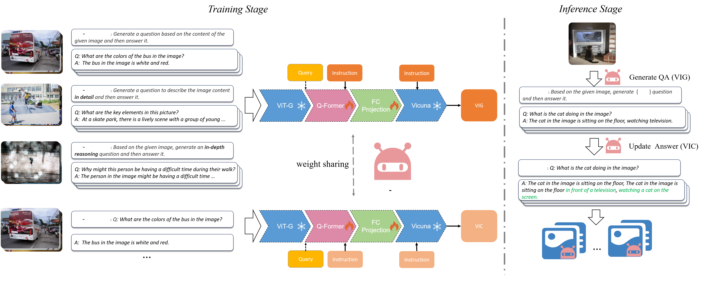

<p align="center">
    <br>
    
    <br>
<p>

<div align="center">
  <a href="https://github.com/salesforce/LAVIS/releases"></a>
  <a href="https://opensource.salesforce.com/LAVIS/index.html">
  
  <a href="https://opensource.org/licenses/BSD-3-Clause">
  
  </a> 
  <a href="https://pepy.tech/project/salesforce-lavis">
  
  </a>
</div>

<div align="center">
<a href="https://opensource.salesforce.com/LAVIS//latest/benchmark.html">Benchmark</a>,
<a href="https://arxiv.org/abs/2209.09019">Technical Report</a>,
<a href="https://opensource.salesforce.com/LAVIS//latest/index.html">Documentation</a>,
<a href="https://github.com/salesforce/LAVIS/tree/main/examples">Jupyter Notebook Examples</a>,
<a href="https://blog.salesforceairesearch.com/lavis-language-vision-library/">Blog</a>
</div>

# VIGC: Visual Instruction Generation and Correction

## Table of Contents
  - [Introduction](#introduction)
  - [Installation](#installation)
  - [Getting Started](#getting-started)
    - [Model Zoo](#model-zoo)
  - [Tutorials](#Tutorials)
    - [Generate QA](#generate-qa)
    - [Train VIGC Model](#train-vigc-model)
    - [Train VQA Model](#train-vqa-model)

  - [Resources and Tools](#resources-and-tools)
  - [Documentations](#documentations)
  - [Paper and Citing VIGC](#paper-and-citing-vigc)
  - [License](#license)

## Introduction
Recent advancements in multimodal large language model have been propelled by the integration of visual encoders and large language models. However, high-quality instruction-tuning data for vision-language tasks is relatively scarce. Current data, mostly generated based on language-only GPT-4, are costly to produce, often lack complete image-corresponding text descriptions, and exhibit limited diversity. To address this issue, we introduce **the Visual Instruction Generation and Correction (VIGC)** framework that enables models to generate high-quality fine-tuning data autonomously. This self-instruct framework consists of the **Visual Instruction Generation (VIG)** model and the **Visual Instruction Correction (VIC)** module. **VIG** guides the vision-language model to generate more diverse fine-tuning data based on existing instruction-tuning data. The quality of the generated data is overseen by the VIC module, which employs an iterative update mechanism to correct the data produced by **VIG**, significantly mitigating the issue of hallucination. **VIGC** provides valuable guidance for multimodal large model research by ensuring the automatic production of diverse data and eliminating hallucinatory content. Leveraging the diverse, high-quality data generated by **VIGC**, we fine-tune mainstream models and validate data quality based on both subjective and objective evaluations. Experimental results demonstrate that our data not only compensates for the shortcomings of text-only data generation methods, but also effectively enhances the overall performance of the models. The models, datasets, and code will be made publicly available.

<p align="center">
    <br>
    
    <br>
<p>

## Installation

1. (Optional) Creating conda environment

```bash
conda create -n vigc python=3.8
conda activate vigc
```

2. Install mmpretrain (you can follow the [tutorial](https://github.com/open-mmlab/mmpretrain))
3. You may build from source

```bash
git clone  https://gitlab.pjlab.org.cn/fdc/mllm/vigc.git
cd vigc
pip install -e .
```

## Getting Started

### Model Zoo

Please download the following pretrained checkpoint and finetuned checkpoint, then modify the `pretrained` and `finetuned` in the corresponding model config.

| VIGC Model              | Pretrain checkpoint                                          | finetuned checkpoint                                         | config                                           |
| ----------------------- | ------------------------------------------------------------ | ------------------------------------------------------------ | ------------------------------------------------ |
| Mini-GPT4(vicuna7b)     | /mnt/petrelfs/hanxiao/input/instruct-blip/blip2_pretrained_flant5xxl.pth | /mnt/petrelfs/hanxiao/input/instruct-blip/minigpt4_proj_7b.pth | vigc/configs/models/mini_gpt4_vicuna7b.yaml      |
| Mini-GPT4(vicuna13b)    | /mnt/petrelfs/hanxiao/input/instruct-blip/blip2_pretrained_flant5xxl.pth | /mnt/petrelfs/hanxiao/input/instruct-blip/minigpt4_proj_13b.pth | vigc/configs/models/mini_gpt4_vicuna13b.yaml     |
| Instruct Blip(vicuna7b) | /mnt/petrelfs/hanxiao/input/instruct-blip/instruct_blip_vicuna7b_trimmed.pth | N/A                                                          | vigc/configs/models/blip2_instruct_vicuna7b.yaml |

### Ready-made VIGC Model

| Model                  | Train Data | checkpoint |
| ---------------------- | ---------- | ---------- |
| Mini-GPT4(vicuna7b)    | Llava      |            |
| Mini-GPT4(vicuna13b)   | Llava      |            |
| InstructBlip(vicuna7b) | A-OKVQA    |            |
| InstructBlip(vicuna7b) | OKVQA      |            |

## Tutorials

### Prepare Vicuna Weights

VIGC uses frozen Vicuna 7B and 13B models. Please first follow the following instructions to prepare Vicuna v1.1 weights. Then modify the `llm_model` in the [Model Config](https://github.com/salesforce/LAVIS/blob/main/lavis/configs/models/blip2/blip2_instruct_vicuna7b.yaml) to the folder that contains Vicuna weights.

```bash
git lfs clone https://huggingface.co/lmsys/vicuna-7b-v1.1  # download vicuna7b weights
git lfs clone https://huggingface.co/lmsys/vicuna-13b-v1.1  # download vicuna13b weights
```

### Generate QA

1. generate QA based on COCO2017 for Llava

   1. You should first download the [finetuned checkpoint file](#ready-made-vigc-model) (Mini-GPT4 vicuna7b or vicuna13b)
   2. Then modify the `finetuned` in corresponding Inference Config to the path to the checkpoint file.

   ```bash
   torchrun --nproc_per_node=8 evaluate.py --cfg-path vigc/projects/mini_gpt4_vicuna7b/generate_qa/llava-150k/generate_llava_qa_conv.yaml   # generate conversation data for Llava using MiniGPT4-vicuna7b
   
   torchrun --nproc_per_node=8 evaluate.py --cfg-path vigc/projects/mini_gpt4_vicuna7b/generate_qa/llava-150k/generate_llava_qa_detail.yaml   # generate detail description data for Llava using MiniGPT4-vicuna7b
   
   torchrun --nproc_per_node=8 evaluate.py --cfg-path vigc/projects/mini_gpt4_vicuna7b/generate_qa/llava-150k/generate_llava_qa_complex.yaml   # generate complex reasoning data for Llava using MiniGPT4-vicuna7b
   
   torchrun --nproc_per_node=8 evaluate.py --cfg-path vigc/projects/mini_gpt4_vicuna13b/generate_qa/llava-150k/generate_llava_qa_conv.yaml   # generate conversation data for Llava using MiniGPT4-vicuna13b
   
   torchrun --nproc_per_node=8 evaluate.py --cfg-path vigc/projects/mini_gpt4_vicuna13b/generate_qa/llava-150k/generate_llava_qa_detail.yaml   # generate detail description data for Llava using MiniGPT4-vicuna13b
   
   torchrun --nproc_per_node=8 evaluate.py --cfg-path vigc/projects/mini_gpt4_vicuna13b/generate_qa/llava-150k/generate_llava_qa_complex.yaml   # generate complex reasoning data for Llava using MiniGPT4-vicuna13b
   ```

2. generate QA based on Object365 for Llava

   1. You should first download the [finetuned checkpoint file](#ready-made-vigc-model) (Mini-GPT4 vicuna7b or vicuna13b)
   2. Then modify the `finetuned` in corresponding Inference Config to the path to the checkpoint file.

   ```bash
   torchrun --nproc_per_node=8 evaluate.py --cfg-path vigc/projects/mini_gpt4_vicuna7b/generate_qa/llava-150k/generate_llava_qa_object365_conv.yaml   # generate conversation data for Llava using MiniGPT4-vicuna7b
   
   torchrun --nproc_per_node=8 evaluate.py --cfg-path vigc/projects/mini_gpt4_vicuna7b/generate_qa/llava-150k/generate_llava_qa_object365_detail.yaml  # generate detail description data for Llava using MiniGPT4-vicuna7b
   
   torchrun --nproc_per_node=8 evaluate.py --cfg-path vigc/projects/mini_gpt4_vicuna7b/generate_qa/llava-150k/generate_llava_qa_object365_complex.yaml   # generate complex reasoning data for Llava using MiniGPT4-vicuna7b
   
   torchrun --nproc_per_node=8 evaluate.py --cfg-path vigc/projects/mini_gpt4_vicuna13b/generate_qa/llava-150k/generate_llava_qa_object365_conv.yaml   # generate conversation data for Llava using MiniGPT4-vicuna13b
   
   torchrun --nproc_per_node=8 evaluate.py --cfg-path vigc/projects/mini_gpt4_vicuna13b/generate_qa/llava-150k/generate_llava_qa_object365_detail.yaml   # generate detail description data for Llava using MiniGPT4-vicuna13b
   
   torchrun --nproc_per_node=8 evaluate.py --cfg-path vigc/projects/mini_gpt4_vicuna13b/generate_qa/llava-150k/generate_llava_qa_object365_complex.yaml   # generate complex reasoning data for Llava using MiniGPT4-vicuna13b
   ```

3. generate QA based on COCO2017 for A-OKVQA or OKVQA

   1. You should first download the  [finetuned checkpoint file](#ready-made-vigc-model) (InstructBlip vicuna7b)

   2. Then modify the `pretrained` in corresponding Inference Config to the path to the checkpoint file.

   3. Generate the question first:

      ```bash
      torchrun --nproc_per_node=8 evaluate.py --cfg-path vigc/projects/instruct_blip_vicuna7b/generate_qa/a-okvqa/generate_question.yaml   # generate questions for A-OKVQA using instruct-blip-vicuna7b
      
      torchrun --nproc_per_node=8 evaluate.py --cfg-path vigc/projects/instruct_blip_vicuna7b/generate_qa/okvqa/generate_question.yaml   # generate questions for OKVQA using instruct-blip-vicuna7b
      ```

   4. Modify the `annotaion` in `generate_answer.yaml` to the path of the questions generated in the above step, then generate the answers: 

      ```bash
      torchrun --nproc_per_node=8 evaluate.py --cfg-path vigc/projects/instruct_blip_vicuna7b/generate_qa/a-okvqa/generate_answer.yaml   # generate answers for A-OKVQA using instruct-blip-vicuna7b
      
      torchrun --nproc_per_node=8 evaluate.py --cfg-path vigc/projects/instruct_blip_vicuna7b/generate_qa/okvqa/generate_answer.yaml   # generate answers for OKVQA using instruct-blip-vicuna7b
      ```

### Train VIGC Model

1. Finetune Instruct Blip to train a A-OKVQA VIGC model

   ```python
   torchrun --nproc_per_node=8 train.py --cfg-path vigc/projects/instruct_blip_vicuna7b/vig/a-okvqa/normal_vqga.yaml
   ```

2. Finetune Instruct Blip to train a OKVQA VIGC model

   ```bash
   torchrun --nproc_per_node=8 train.py --cfg-path vigc/projects/instruct_blip_vicuna7b/vig/okvqa/normal_vqga.yaml
   ```

3. Finetune Mini-GPT4 to train a Llava instruct 150k VIGC model

   ```bash
   torchrun --nproc_per_node=8 train.py  --cfg-path vigc/projects/mini_gpt4_vicuna7b/vig/llava-150k/normal_vqga.yaml  # using Mini-GPT4 Vicuna7b
   
   torchrun --nproc_per_node=8 train.py  --cfg-path vigc/projects/mini_gpt4_vicuna13b/vig/llava-150k/normal_vqga.yaml  # using Mini-GPT4 Vicuna13b
   ```

### Train VQA Model

1. Train a baseline model of A-OKVQA using Instruct Blip

   ```bash
   torchrun --nproc_per_node=8 train.py  --cfg-path vigc/projects/instruct_blip_vicuna7b/vqa/a-okvqa/normal_vqa.yaml  # using Instructblip Vicuna7b
   ```

2. Make use of VIGC data to train a better model of A-OKVQA using Instruct Blip

   ```bash
   torchrun --nproc_per_node=8 train.py  --cfg-path vigc/projects/instruct_blip_vicuna7b/vqa/a-okvqa/coco_pseudo_vqa.yaml  # using Instructblip Vicuna7b
   ```

3. Train a baseline model of OKVQA using Instruct Blip

   ```bash
   torchrun --nproc_per_node=8 train.py  --cfg-path vigc/projects/instruct_blip_vicuna7b/vqa/okvqa/normal_vqa.yaml  # using Instructblip Vicuna7b
   ```

4. Make use of VIGC data to train a better model of OKVQA using Instruct Blip

   ```bash
   torchrun --nproc_per_node=8 train.py  --cfg-path vigc/projects/instruct_blip_vicuna7b/vqa/okvqa/coco_pseudo_vqa.yaml  # using Instructblip Vicuna7b
   ```

## Resources and Tools
- **GUI Demo**: to run the demo locally, run ```bash vigc_demo.sh``` and then follow the instruction on the prompts to view in browser. Arguments are as follows:
  - device0: The gpu id of the first model
  - device1: The gpu id of the second model
  - ckpt_minigpt4: The checkpoint file of the Mini-GPT4 model
  - ckpt_instruct_blip: The checkpoint file of the Instruct Blip model


## Documentations
For more details and advanced usages, please refer to
[documentation](https://opensource.salesforce.com/LAVIS//latest/index.html#).


## Paper and Citing VIGC
You can find more details in our [paper](https://arxiv.org/abs/2209.09019).

If you're using VIGC in your research or applications, please cite using this BibTeX:
```bibtex
@misc{li2022lavis,
      title={LAVIS: A Library for Language-Vision Intelligence}, 
      author={Dongxu Li and Junnan Li and Hung Le and Guangsen Wang and Silvio Savarese and Steven C. H. Hoi},
      year={2022},
      eprint={2209.09019},
      archivePrefix={arXiv},
      primaryClass={cs.CV}
}
```

## Contact us
If you have any questions, comments or suggestions, please do not hesitate to contact us at lavis@salesforce.com.

## License
[BSD 3-Clause License](LICENSE.txt)
